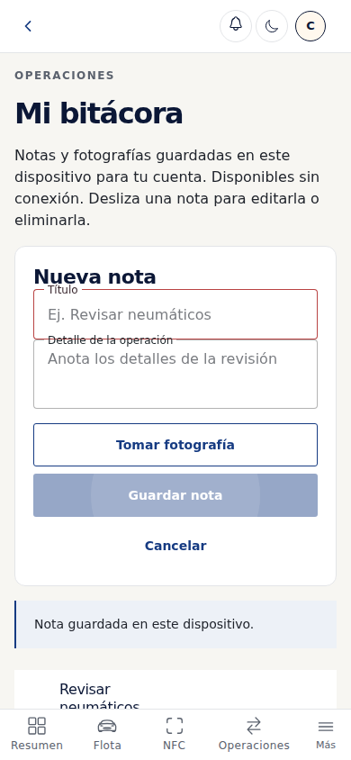
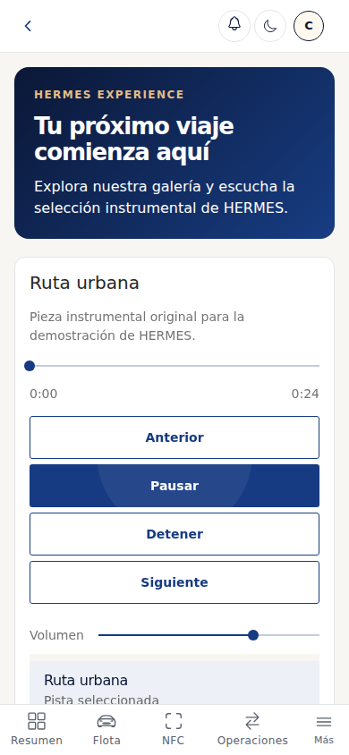
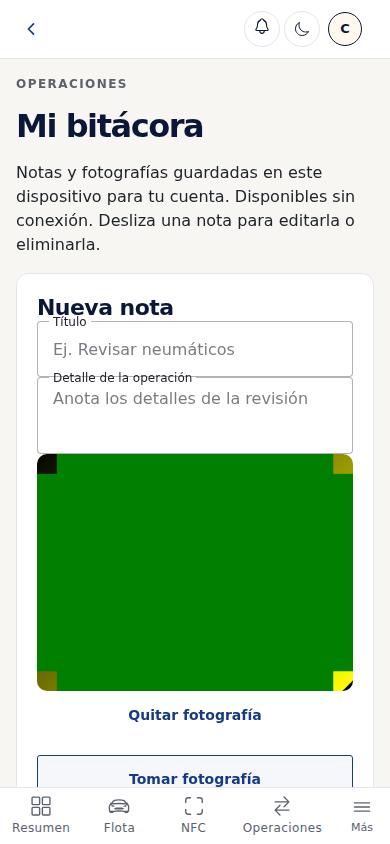
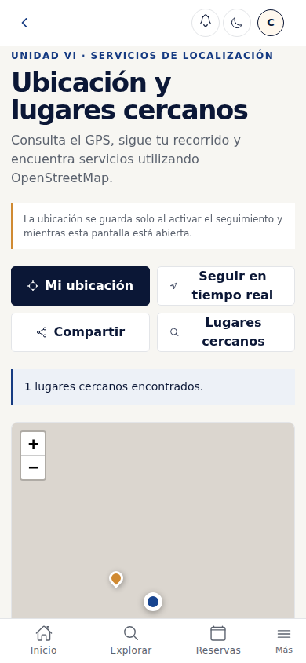

# HERMES SYSTEM

Aplicación web y móvil de gestión de alquiler de vehículos, construida con Ionic, Angular y Capacitor. Integra acceso por roles, gestión operativa, NFC, localización, multimedia, captura de fotografías y una bitácora local disponible sin conexión.

## Instalación

```sh
git clone https://github.com/leilameca/Hermes-System.git
cd Hermes-System
npm ci
npm start
```

La aplicación abre en `http://localhost:4200`. Las cuentas de prueba requieren las credenciales configuradas en Supabase; elegir un perfil solo completa el correo.

## Cobertura de las unidades

| Unidades | Función integrada | Código principal |
| --- | --- | --- |
| 1 y 2 | Rutas por rol, carga diferida, tabs y navegación de regreso | `app.routes.ts`, `features/demo/demo.routes.ts`, `layouts/demo-layout` |
| 3 | Formularios y listas Ionic; swipe y pull-to-refresh en bitácora | `features/notes/notes.page.ts` |
| 4 | Estado online/offline y sincronización de operaciones | `core/services/network.service.ts`, `offline.service.ts` |
| 5 | Lectura y escritura NFC de vehículos | `core/services/nfc.service.ts`, `features/nfc` |
| 6 | GPS, mapa Leaflet, marcadores y zona de referencia en primer plano | `core/services/location.service.ts`, `features/location` |
| 7 | Lista de audio local con controles propios, galería y video externo | `features/multimedia` |
| 8 | Captura con Capacitor Camera en bitácora y evidencias operativas | `core/services/camera.service.ts`, `features/notes`, `features/demo/demo-screen.page.ts` |
| 9 | CRUD local de notas y fotos con Ionic Storage, separado por usuario y empresa | `core/services/local-notes.service.ts` |
| 10 | GET de búsqueda y POST de lugares, carga, errores y caché por cuenta | `core/services/location.service.ts` |

### Requisitos de plataforma

- En Android instalado, NFC usa el plugin nativo. En web requiere Chrome Android con Web NFC y HTTPS; un navegador de escritorio informa que no tiene soporte.
- La cámara web necesita una cámara disponible y permiso del navegador. Android usa la aplicación de cámara del dispositivo mediante Capacitor.
- GPS solicita permiso. El seguimiento y la zona de referencia funcionan mientras la pantalla está abierta; al salir se detienen. No son seguimiento en segundo plano.
- El video de YouTube, los mapas base y nuevas consultas externas requieren Internet.
- La bitácora y los audios locales funcionan sin red en Android. En web, la compilación de producción prepara caché de aplicación y medios mediante Angular Service Worker: primero hay que abrirla con conexión y mantener una sesión vigente previamente iniciada.
- `npm start` sirve desarrollo y no activa el Service Worker. Para comprobar recarga web sin conexión, usar la versión de producción en HTTPS o localhost.
- La caché de mapas puede mostrar consultas anteriores al perder la red; la interfaz las identifica como resultados guardados.
- La cola guarda cada operación con su cuenta y empresa originales. Reintenta con el mismo UUID para evitar duplicados. Los registros antiguos sin autor verificable se preservan y no se sincronizan automáticamente con otra cuenta.
- Facturación, mantenimiento y suscripciones conservan algunas vistas y acciones de demostración de la base original. No representan una pasarela de pagos ni un sistema contable completo.

## Pruebas

```sh
npm run check
npx playwright install chromium
npm run test:e2e
npm run test:pwa
```

`check` ejecuta TypeScript, seis pruebas de almacenamiento y cola, verificación estructural y build. Las siete pruebas de navegador verifican CRUD local offline, persistencia, audio, navegación, cámara virtual, GPS con coordenadas controladas, GET/POST con respuestas controladas, caché, errores y gestos. Una prueba adicional verifica la recarga y reproducción sin red de la compilación de producción.

Las pruebas automatizadas usan transporte simulado y cámara virtual. No acreditan por sí solas autenticación remota real, políticas RLS para cada rol, lectura NFC física ni captura en Android. También se verificó en la base de datos conectada la inserción y lectura de una inspección y un incidente bajo el rol autenticado de agente, en una transacción revertida sin registros permanentes. Antes de defender hay que ejecutar los flujos completos con las cuentas y el teléfono reales.

La compilación de producción termina correctamente; conserva una advertencia de tamaño del paquete inicial (aproximadamente 1,38 MB frente al umbral de aviso de 1,3 MB).

## Compilar y abrir Android

```sh
npm run sync:android
npm run open:android
```

Requiere Android Studio y SDK. Instalar la app en el teléfono, permitir ubicación y probar NFC con una etiqueta compatible. La captura de fotografías no guarda automáticamente en la galería.

## Capturas de la versión local

Capturas obtenidas al ejecutar la aplicación en navegador con cuenta, coordenadas, API y cámara de pruebas controladas. Son evidencias de interfaz y comportamiento local, no de uso físico de NFC ni del backend real.

| Bitácora y persistencia | Multimedia |
| --- | --- |
|  |  |

| Cámara virtual | GPS y mapa |
| --- | --- |
|  |  |

## Equipo y distribución para revisión y defensa

Las responsabilidades siguientes distribuyen estudio, pruebas y defensa. No atribuyen autoría de código a quien no lo desarrolló.

| Integrante | Matrícula | Responsabilidad |
| --- | --- | --- |
| Leilany Morán | 100074062 | Conectividad y NFC, U4 y U5 |
| Gustavo Pascual | 100058813 | Navegación, roles y servicios web, U1, U2 y U10 |
| Jhovanny Rosado | 100069725 | Multimedia y captura, U7 y U8 |
| Luis Eduardo Matos | 100073071 | Interfaz, gestos y almacenamiento local, U3 y U9 |
| Jean de la Rosa | 100039486 | Geolocalización, U6 |

El aporte original de multimedia está en el commit `7cb3d3a`, realizado por Jhovanny. Las ampliaciones e integración asistidas deben declararse conforme a las indicaciones del facilitador; cada integrante necesita comprender su módulo.

## Estructura

- `src/app/core`: modelos y servicios.
- `src/app/features`: pantallas funcionales.
- `src/app/layouts`: menú lateral, encabezado y tabs.
- `src/app/shared`: componentes reutilizables.
- `src/assets`: marca, imágenes y dos audios instrumentales originales.
- `tests`: pruebas de almacenamiento y navegador.
- `supabase/migrations`: tablas y políticas.
- `supabase/functions`: creación de cuentas de clientes.
- `android`: proyecto nativo.

## Base de datos y despliegue

El frontend contiene únicamente la clave pública de Supabase. Las claves privilegiadas permanecen en el servidor. Las migraciones se aplican en orden según su fecha; revisar las instrucciones del proyecto antes de modificar el esquema.

El README original indica que Vercel publica `develop`. La integración debe revisarse y llevarse a esa rama antes de tomar evidencias de la aplicación publicada. Este cambio se prepara mediante una rama y pull request; no equivale a un despliegue ya realizado.
