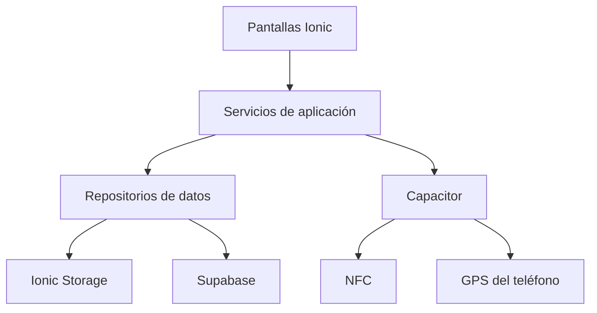
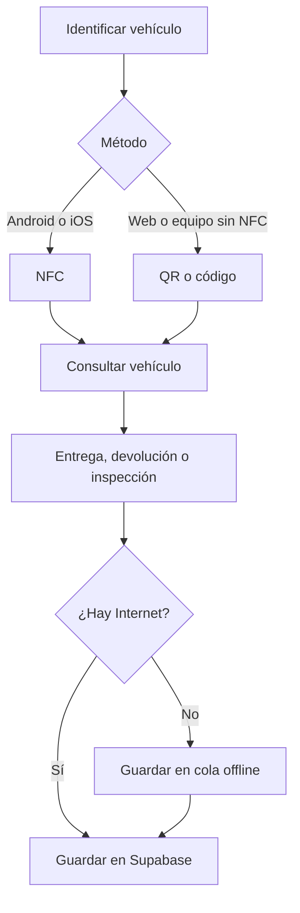

# Arquitectura SaaS de HERMES SYSTEM

## Propósito

HERMES SYSTEM será una plataforma multiempresa para negocios de alquiler de vehículos. La misma aplicación Ionic funcionará en web, Android e iOS. Cada empresa tendrá sus propios usuarios, vehículos, clientes y operaciones.

## Principios de trabajo

1. Cada cambio se desarrolla en una rama independiente.
2. `main` se mantiene estable.
3. No se mezclan cambios de NFC, GPS y base de datos en un mismo commit.
4. Los comentarios explican decisiones importantes y se redactan en español.
5. La interfaz no accede directamente a Supabase; utiliza servicios o repositorios.
6. Ionic Storage se conserva como caché y cola offline.
7. La etiqueta NFC almacena un token, nunca datos del cliente o del contrato.
8. Toda tabla operativa contiene `organization_id` para separar las empresas.
9. Las políticas RLS de Supabase controlan el acceso por empresa.
10. Antes de fusionar una rama se ejecutan `npm run typecheck` y `npm run build`.

## Capas de la aplicación

- **Pantallas Ionic:** muestran información y reciben acciones del usuario.
- **Servicios de aplicación:** coordinan casos de uso como asignar una etiqueta o entregar un vehículo.
- **Repositorios:** permiten cambiar entre datos locales y Supabase sin reescribir las pantallas.
- **Ionic Storage:** mantiene caché y operaciones pendientes cuando no hay Internet.
- **Supabase:** centraliza autenticación, datos y seguridad multiempresa.
- **Capacitor:** conecta la aplicación con las funciones nativas del teléfono.

## Flujo operativo principal

## Integración de NFC

La etiqueta contiene un valor con el formato `HERMES:V1:<token>`. El token se relaciona con un vehículo en la tabla `nfc_tags`.

1. El agente selecciona un vehículo.
2. La aplicación genera el token.
3. El token se escribe en la etiqueta NDEF.
4. La asociación se guarda localmente y en Supabase.
5. Una lectura posterior resuelve el token.
6. La aplicación abre la ficha del vehículo.
7. El agente inicia una entrega, devolución, inspección o incidente.

## Módulos previstos

| Módulo | Responsabilidad |
|---|---|
| Autenticación | Inicio de sesión, sesión y recuperación de acceso |
| Empresas | Configuración de cada rent a car |
| Usuarios | Perfiles, agentes, administradores y permisos |
| Flota | Vehículos, estado, disponibilidad y documentos |
| Clientes | Información de contacto y documento |
| Reservas | Fechas, vehículo solicitado y estado |
| Alquileres | Contrato, entrega y devolución |
| NFC | Asociación y lectura de etiquetas |
| Inspecciones | Checklist, combustible, kilometraje y evidencias |
| Incidentes | Daños, descripción, ubicación y seguimiento |
| GPS | Ubicación capturada por la aplicación y futura telemetría |
| Offline | Cola local y sincronización al recuperar Internet |

## Estrategia por plataforma

- **Web:** administración, reservas, flota y alternativa mediante QR o código.
- **Android:** todas las funciones web, lectura/escritura NFC y GPS.
- **iOS:** base Ionic compartida; NFC y GPS requieren capacidades y permisos nativos.
