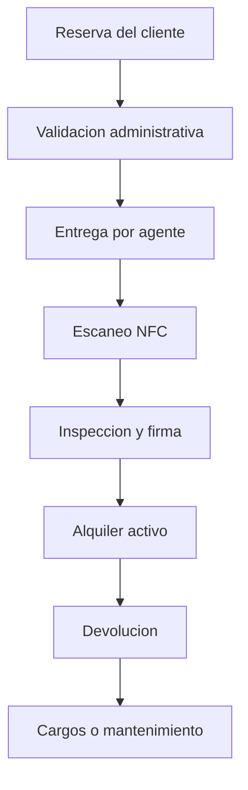

# Flujos de HERMES SYSTEM por perfil

Los modulos se organizan alrededor del ciclo real de una empresa rent a car en Republica Dominicana.

## Cliente

1. Crear o completar su perfil.
2. Registrar cedula o pasaporte y licencia de conducir.
3. Buscar vehiculos por fecha, sucursal, categoria y precio en pesos dominicanos.
4. Solicitar una reserva y consultar deposito, seguro, impuestos y condiciones.
5. Revisar contrato, factura y estado de pago.
6. Consultar entregas, devoluciones e incidentes asociados a sus alquileres.

## Agente

1. Consultar las entregas y devoluciones asignadas durante la jornada.
2. Escanear la tarjeta NFC para confirmar el vehiculo correcto.
3. Validar cedula o pasaporte, licencia y datos del conductor.
4. Registrar kilometraje, combustible, carroceria, neumaticos y accesorios.
5. Adjuntar fotografias y obtener la firma del cliente.
6. Registrar incidentes y guardar temporalmente la operacion cuando no haya Internet.

## Administrador de la rent a car

1. Administrar sucursales, empleados y permisos.
2. Gestionar clientes, reservas, contratos y disponibilidad.
3. Controlar flota, etiquetas NFC, seguros, matriculas y mantenimientos.
4. Supervisar entregas, devoluciones, inspecciones, incidentes y ubicaciones GPS.
5. Revisar facturacion en DOP, depositos, cargos adicionales y reportes operativos.

## Superadministrador de HERMES

1. Crear y supervisar las empresas afiliadas.
2. Gestionar planes, limites, suscripciones y estado del servicio.
3. Consultar auditoria, salud de la plataforma e integraciones.
4. Dar soporte sin mezclar la informacion privada de distintas empresas.

## Relacion operativa

El GPS del telefono demostrara la ubicacion de una entrega, devolucion, inspeccion o incidente. El rastreo continuo del vehiculo dependera de un dispositivo GPS u OBD instalado en la unidad.
