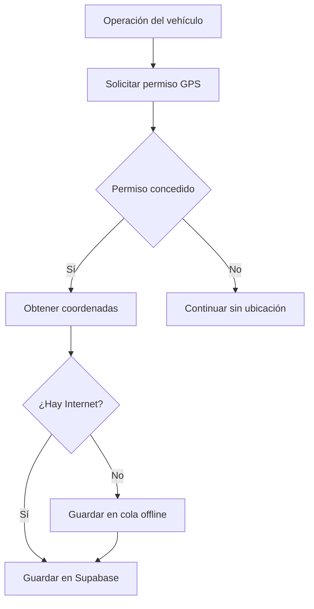

# Plan del módulo GPS

## Objetivo

El módulo GPS permitirá asociar coordenadas con vehículos y operaciones. Debe distinguirse entre la ubicación del teléfono y la ubicación real del vehículo.

## Alcance académico inicial

En la primera versión se utilizará `@capacitor/geolocation` para capturar la ubicación del teléfono cuando un agente:

- inicia una entrega;
- recibe una devolución;
- realiza una inspección;
- registra un incidente;
- actualiza manualmente la última ubicación conocida.

Esta solución demuestra conectividad y geolocalización sin mantener rastreo permanente.

## Alcance de un producto real

Un teléfono no puede rastrear continuamente un vehículo cuando el empleado o el cliente se aleja. Para rastreo real se necesita uno de estos métodos:

1. dispositivo GPS instalado en el vehículo;
2. plataforma de telemetría con API;
3. equipo OBD-II con datos móviles;
4. teléfono dedicado que permanezca dentro del vehículo.

HERMES almacenará todas las ubicaciones con un campo `source` para diferenciar `mobile_app`, `manual`, `gps_device` y `telematics_api`.

## Flujo propuesto

## Datos mínimos

- vehículo;
- empresa;
- fecha y hora;
- latitud y longitud;
- precisión;
- velocidad y dirección, si están disponibles;
- fuente de la ubicación;
- usuario que realizó el registro;
- operación relacionada.

## Reglas de privacidad

1. Solicitar permiso solamente cuando una función lo necesite.
2. Explicar al usuario por qué se solicita la ubicación.
3. No iniciar rastreo oculto.
4. No guardar ubicaciones de clientes sin una finalidad definida.
5. Permitir continuar la operación si el permiso fue rechazado.
6. Registrar quién capturó cada ubicación.
7. Definir una política de conservación antes de activar historial prolongado.

## Implementación prevista

1. Instalar `@capacitor/geolocation`.
2. Crear `LocationService` como único acceso al complemento.
3. Crear el modelo `VehicleLocation`.
4. Guardar sin conexión mediante `OfflineService`.
5. Sincronizar con la tabla `vehicle_locations`.
6. Mostrar la última ubicación en la ficha del vehículo.
7. Incorporar un mapa solamente después de validar captura, permisos y privacidad.
