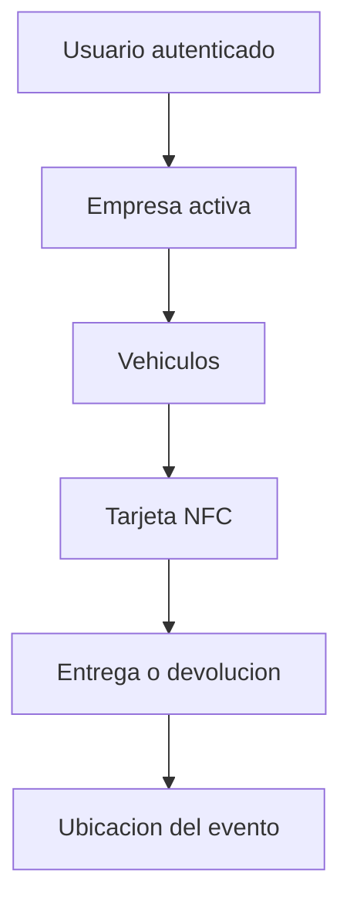

# Conexion de HERMES SYSTEM con Supabase

## Estado de esta etapa

La aplicacion ya tiene el cliente oficial de Supabase y la configuracion publica del proyecto. Los servicios actuales siguen usando datos de demostracion hasta migrarlos de forma individual.

## Activar la base de datos

1. Abrir el proyecto de HERMES en Supabase.
2. Entrar en **SQL Editor**.
3. Crear una consulta nueva.
4. Copiar el contenido de `supabase/migrations/202609210001_initial_saas.sql`.
5. Ejecutar la consulta una sola vez.
6. Confirmar en **Table Editor** que aparezcan las tablas nuevas.

La funcion `create_organization` permitira que un usuario autenticado cree su empresa y quede registrado como administrador sin desactivar las politicas de seguridad.

## Tablas de la primera etapa

| Tabla | Responsabilidad |
|---|---|
| `organizations` | Empresas rent a car |
| `profiles` | Datos basicos del usuario autenticado |
| `memberships` | Empresa y rol de cada usuario |
| `branches` | Sucursales de la empresa |
| `vehicles` | Flota de vehiculos |
| `nfc_tags` | Tarjetas vinculadas con vehiculos |
| `nfc_events` | Historial de asignaciones y lecturas NFC |
| `location_events` | Ubicaciones de entregas, devoluciones e inspecciones |

## Seguridad

Todas las tablas tienen Row Level Security. Un usuario autenticado solo puede consultar datos de las empresas donde tenga una membresia activa. La clave publica puede estar en la aplicacion; la clave `service_role` nunca debe copiarse al proyecto Ionic.

## Flujo previsto

El GPS del telefono registra el lugar de una operacion. El seguimiento permanente del vehiculo requerira mas adelante un dispositivo GPS u OBD y una integracion de telemetria.

## Siguiente etapa

1. Ejecutar `202609210002_auth_roles_and_customers.sql`.
2. Crear las cuatro cuentas iniciales desde **Authentication / Users**.
3. Ejecutar `select * from public.configure_demo_accounts();` en SQL Editor.
4. Verificar el acceso de cada perfil.
5. Migrar vehiculos sin cambiar la interfaz actual.
6. Guardar las asociaciones NFC en `nfc_tags`.
7. Conectar reservas, contratos, entregas y devoluciones.

## Desarrollo y despliegue web

HERMES puede utilizarse como aplicacion web mientras se desarrollan los modulos. El archivo `vercel.json` prepara el proyecto para Vercel y conserva las rutas de Angular al actualizar el navegador.

- Comando de construccion: `npm run build`
- Carpeta publicada: `www`
- NFC: disponible en la aplicacion nativa; la web mostrara su alternativa operativa.
- GPS del telefono: requiere permiso del navegador y se usara solamente en operaciones autorizadas.
