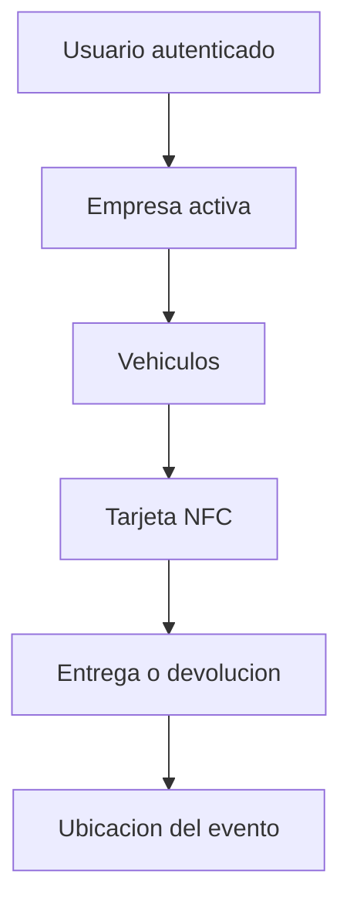

# Conexion de HERMES SYSTEM con Supabase

## Estado de esta etapa

La aplicacion ya usa Supabase para autenticacion, empresas, vehiculos, clientes,
reservas, operaciones, contratos, incidentes y registros NFC. Los datos incluidos
en las migraciones son solamente para pruebas.

## Activar la base de datos

1. Abrir el proyecto de HERMES en Supabase.
2. Entrar en **SQL Editor**.
3. Crear una consulta nueva.
4. Ejecutar en orden los cinco archivos de `supabase/migrations`.
5. Confirmar en **Table Editor** que aparezcan las tablas nuevas.

La funcion `create_organization` permitira que un usuario autenticado cree su empresa y quede registrado como administrador sin desactivar las politicas de seguridad.

## Tablas de la primera etapa

| Tabla | Responsabilidad |
|---|---|
| `organizations` | Empresas rent a car |
| `profiles` | Datos basicos del usuario autenticado |
| `memberships` | Empresa y rol de cada usuario |
| `branches` | Sucursales de la empresa |
| `vehicles` | Flota de vehiculos |
| `nfc_tags` | Tarjetas vinculadas con vehiculos |
| `nfc_events` | Historial de asignaciones y lecturas NFC |
| `location_events` | Ubicaciones de entregas, devoluciones e inspecciones |
| `customer_location_events` | Recorrido compartido por clientes con la app abierta |
| `customer_documents` | Metadatos de licencias, identificaciones y documentos privados |

La migracion `202609220005_crm_completion.sql` agrega tambien tres buckets privados:
`vehicle-images`, `operation-evidence` y `crm-documents`. Las politicas RLS separan
los archivos por empresa y los enlaces de lectura tienen vencimiento.

## Seguridad

Todas las tablas tienen Row Level Security. Un usuario autenticado solo puede consultar datos de las empresas donde tenga una membresia activa. La clave publica puede estar en la aplicacion; la clave `service_role` nunca debe copiarse al proyecto Ionic.

## Flujo previsto



El GPS del telefono registra el lugar de una operacion. El seguimiento permanente del vehiculo requerira mas adelante un dispositivo GPS u OBD y una integracion de telemetria.

## Preparar las cuentas de prueba

1. Ejecutar `202609210002_auth_roles_and_customers.sql`.
2. Crear las cuatro cuentas iniciales desde **Authentication / Users**.
3. Ejecutar `select * from public.configure_demo_accounts();` en SQL Editor.
4. Verificar el acceso de cada perfil.
5. Verificar que cada cuenta abra el espacio de su rol.
6. Probar que los vehiculos aparezcan antes de asignar etiquetas NFC.

## Registro de clientes por empresa

La migracion `202609220004_customer_registration.sql` agrega un enlace publico distinto para cada empresa. Por ejemplo, la empresa de prueba utiliza:

`https://hermes-system.vercel.app/login?empresa=quisqueya-rent-a-car`

Desde ese inicio de sesion aparece la opcion **Crear mi cuenta**. El cliente queda enlazado solamente con la empresa indicada en el enlace.

Para permitir que un administrador cree una cuenta con contrasena temporal:

1. Ejecutar `202609220004_customer_registration.sql` en **SQL Editor**.
2. Publicar la funcion `supabase/functions/create-customer-account` como **create-customer-account**.
3. Mantener `SUPABASE_SERVICE_ROLE_KEY` exclusivamente en los secretos de Supabase. Nunca copiar su valor a Angular ni a Vercel.

Las cuentas creadas por administracion deben cambiar la contrasena temporal antes de entrar al resto de la plataforma.

## Desarrollo y despliegue web

HERMES puede utilizarse como aplicacion web mientras se desarrollan los modulos. El archivo `vercel.json` prepara el proyecto para Vercel y conserva las rutas de Angular al actualizar el navegador.

- Comando de construccion: `npm run build`
- Carpeta publicada: `www`
- NFC: disponible en Android instalado y en Chrome para Android.
- GPS del telefono: requiere permiso del navegador y se usara solamente en operaciones autorizadas.

## Aplicar la ampliacion del CRM con Supabase CLI

Desde la carpeta principal del proyecto:

```powershell
npx supabase login
npx supabase link --project-ref ymgglpxuqcbedcbvglwd
npx supabase db push
```

El ultimo comando aplica disponibilidad sin cruces, Storage privado, documentos,
permisos protegidos y ubicaciones de clientes. Debe ejecutarse antes de probar las
funciones nuevas en Vercel o Android.
